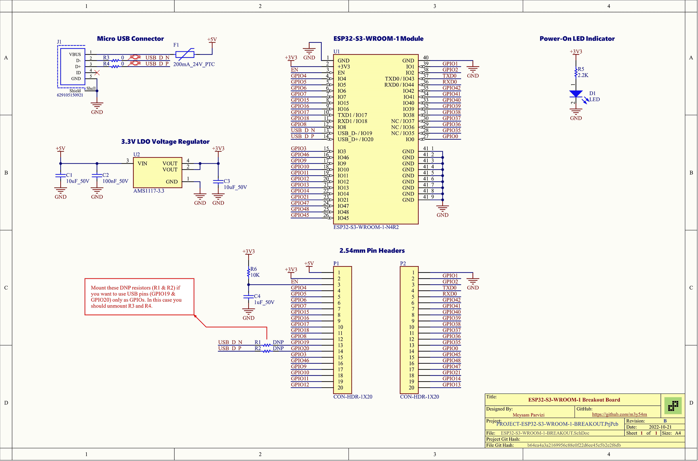
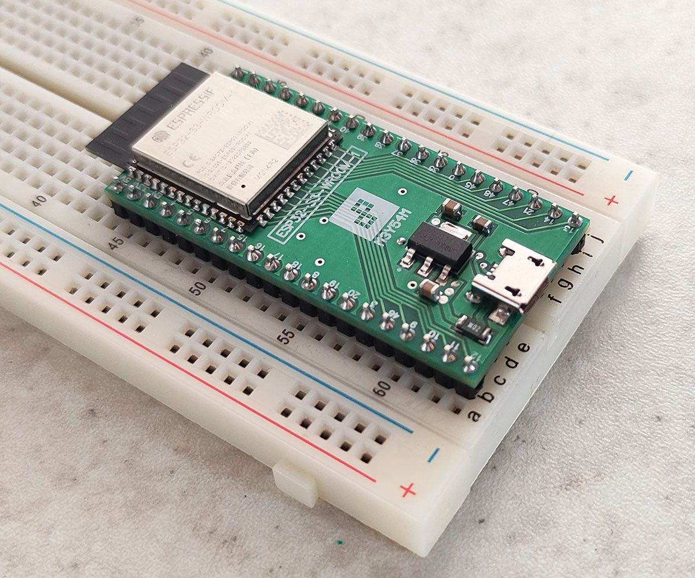

# ESP32-S3-WROOM-1 Breakout Board

This is a very basic breakout board for ESP32-S3-WROOM-1 module designed in Altium Designer.
It connects all module pins to 2.54mm pin headers in order to be able to put it on a breadboard.
There is a 3.3V regulator on the board to convert 5V input voltage to 3.3V which is fed to the module.

## Schematics

## Pictures

